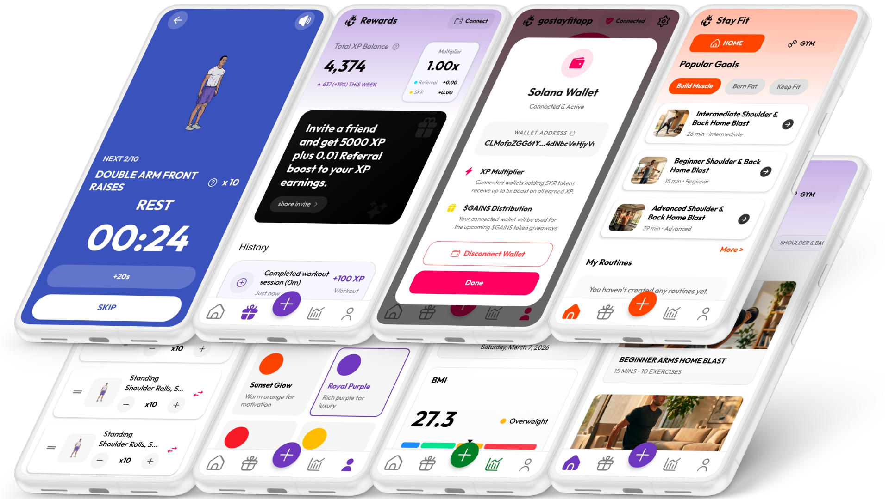

# StayFit - Move-to-Earn Fitness for the Seeker Community

StayFit is a native Android fitness application engineered specifically for the Solana Seeker. It transforms physical performance into on-chain rewards by tracking sets, building streaks, and earning XP - all powered by the Solana Mobile Stack and Mobile Wallet Adapter.

## Project Links
- **Direct Download**: [Stay.Fit.Installer.apk](https://github.com/vMcCharlie/stayfit-solana/releases/download/v1.0.0/Stay.Fit.Installer.apk)
- **Pitch Deck**: [View on Google Drive](https://drive.google.com/file/d/10Cv1bccLpFEtc9Lo6ZriH-HR60PlKOqK/view?usp=sharing)
- **Demo Video**: [Watch on YouTube](https://youtu.be/bXomG7mu8LU)

## Short Description
StayFit is a professional-grade fitness tracker that integrates deeply with the Solana blockchain to reward real-world physical activity with XP and $GAINS allocation, amplified by the use of $SKR. Built natively for mobile, it leverages device sensors and the Mobile Wallet Adapter to provide a seamless transition between fitness and decentralized finance through token-gated features and multipliers.

## Why Seeker users will love StayFit
StayFit provides Seeker users with a legitimate, high-utility fitness tool that justifies its place on a flagship crypto-native device. By holding SKR tokens, users unlock tangible in-app advantages like custom routine builders and NFT photo minting, turning their daily health habits into a strategic on-chain advantage. The app fully utilizes the Seeker's hardware capabilities, including haptic feedback and secure wallet interaction, to deliver a premium experience found nowhere else in the ecosystem.

---

## Core Features

### Professional Workout Engine
- Comprehensive exercise library with 100+ entries, form guidance, and animations.
- Dynamic equipment toggles to switch between Home and Gym environments.
- Live session tracking for sets, reps, weight, and rest intervals.
- Intelligent rest timers with haptic alerts and spoken countdowns.
- Persistent session banner allowing users to resume interrupted workouts.

### Advanced Habit Formation
- Streak System: Automated tracking with Fire (active), Ice (rest), and Freeze (manual preservation) states.
- Multi-day Challenges: Structured programs with progressive difficulty and completion rewards.
- Detailed Reporting: Visualized analytics for weight trends, BMI, and muscle group focus areas.
- Achievement Engine: Tiered milestones that reward consistency and intensity.

### Data Privacy and Personalization
- Personalized onboarding that tailors workout frequency and volume based on goals and metrics.
- Dynamic theming system with professional color palettes and full Dark Mode support.
- Local data persistence and offline-first capabilities for reliable use in gym environments.

---

## Solana Mobile Stack Integration

### Mobile Wallet Adapter (MWA)
StayFit utilizes the Mobile Wallet Adapter protocol for secure, seamless authorization on the Solana mainnet. Users can connect phantom or other compatible wallets with a single tap to verify token holdings and sign transactions.

### SKR Tier System
Your $SKR balance determines your rewards multiplier and unlocks exclusive application features.

| Tier | SKR Required | Multiplier | Feature Unlocks |
|---|---|---|---|
| None | 0 | 1.0x | Basic tracking and community access |
| Bronze | 1+ | 1.2x | **Custom Workout Routine Creator** |
| Silver | 4,000+ | 1.5x | **Unlimited Rest Days** (beyond 2 per week) |
| Gold | 40,000+ | 2.5x | **On-Chain Progress Photo NFTs** |
| Platinum | 400,000+ | 5.0x | Maximum reward velocity and prestige status |

### XP Economy
XP is the core reward unit of StayFit, calculated as:
`XP = (Base XP + Time Bonus + Calorie Bonus) x Tier Multiplier`
Total accumulated XP directly influences your proportional share in the upcoming $GAINS token distribution.

---

## Technical Architecture

StayFit is built using a modern, scalable stack designed for high performance and reliability.

- **Frontend**: React Native with Expo SDK 54 and Expo Router for typed navigation.
- **Animations**: React Native Reanimated for high-frame-rate UI transitions.
- **Backend**: Supabase (Postgres) for distributed data, authentication, and structured storage.
- **Compute**: Deno Edge Functions for serverless logic including XP calculations and streak management.
- **Blockchain**: Metaplex UMI and Mobile Wallet Adapter for on-chain identity and NFT minting.

### Directory Structure
- `app/`: Typed screens and shared UI components.
- `src/context/`: Global state management for Authentication, Wallet, and Themes.
- `src/services/`: Modular API clients, NFT services, and notification handlers.
- `supabase/`: Database schema, migrations, and server-side Edge Functions.

---

## Getting Started

### Prerequisites
- Node.js 18 or higher
- Android Studio (for custom dev builds)
- A Solana mobile wallet (Phantom/Solflare)

### Setup
1. Clone the repository and install dependencies: `npm install`.
2. Configure your environment: `cp .env.example .env`.
3. Provide your Supabase URL and Anon Key in the `.env` file.

### Execution
- **Development**: `npx expo run:android` (Requires a physical device for MWA testing).
- **Production Build**: Refer to `APK_BUILD_GUIDE.md` for Gradle assembly instructions.
